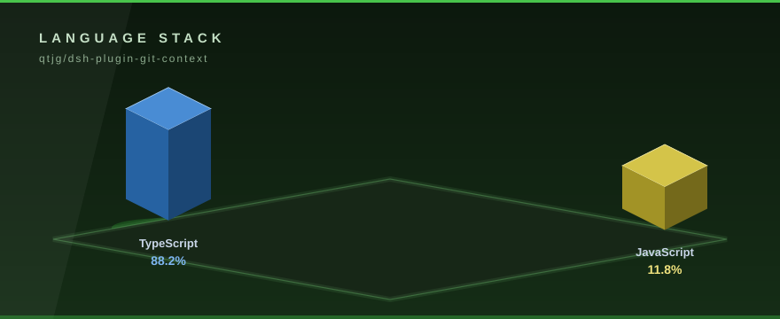

# @qtjg/dsh-plugin-git-context

<p align="center">
  
</p>


<!-- ⬡ 3D-UPGRADE v2 by Mayank Bhaskar -->
<div align="center">

**made by [Mayank Bhaskar](https://github.com/qtjg)** ·  

</div>

---
🩺 **New tool — `repo-pulse`**: instant git pulse (28-day heat bars, hot files, contributors). Run: `node tools/repo-pulse.mjs`

`@qtjg/dsh-plugin-git-context` adds two model-facing tools to [DeepSeek Harness](https://github.com/deepseek-ai/deepseek-harness). `git_context` exposes bounded Git status, diff, and recent log views. `git_review` sends the current unstaged diff through the Harness `ctx.llm` service for an independent review pass and returns concrete findings.

## Requirements

The plugin targets **Node.js 22.19 or newer**. A deployment using `git_context` must provide the Harness `ctx.tools` and `ctx.subprocess` services. A deployment using `git_review` must also provide `ctx.llm` and an active LLM adapter, such as the official DeepSeek route supplied by `@deepseek-ai/dsh-llm-deepseek`.

## Install

From a Harness profile, install the package as an out-of-tree plugin:

```sh
dsh plugin --profile headless add @qtjg/dsh-plugin-git-context
```

Then add the plugin to the profile’s Cordis patch. To enable review through the official DeepSeek adapter, configure the provider route and model explicitly:

```yaml
- id: git-context
  plugin: '@qtjg/dsh-plugin-git-context'
  config:
    cwd: /path/to/your/checkout
    reviewProvider: deepseek-official
    reviewModel: deepseek-v4-flash
```

The profile must also mount the Harness LLM runtime and the `llm-deepseek` adapter. The adapter resolves its API credential through the normal Harness configuration and credential paths; this plugin does not read or store an API key.

The `cwd` directory must be a Git working tree or a directory inside one. Git itself resolves the repository root and reports a normal diagnostic when the directory is not a repository.

## Configuration

| Field | Default | Description |
|---|---:|---|
| `cwd` | Harness process directory | Directory passed to Git as its working directory. |
| `maxBytes` | `100000` | Maximum retained bytes for each ordinary Git output stream. The retained value is the stream tail when the limit is exceeded. |
| `maxLogEntries` | `20` | Maximum number of commits accepted by `git_context` `log`. |
| `graceMs` | `2000` | Process-tree termination grace period used by the subprocess service. |
| `reviewProvider` | unset | Registered `ctx.llm` provider route used by `git_review`. Required for review. |
| `reviewModel` | unset | Model id passed to the configured LLM provider. Required for review. |
| `reviewMaxTokens` | `2000` | Maximum output tokens for one review call. |
| `reviewMaxDiffBytes` | `50000` | Maximum diff bytes sent to the review model. |

The plugin validates positive integer limits at load time and rejects unsupported argument combinations before starting Git or an LLM call.

## Usage

Ask the model for a repository view:

```text
Use git_context with operation=status.
Use git_context with operation=diff and path=packages/core/tools/src/index.ts.
Use git_context with operation=log and limit=10.
```

Ask the model for an independent review:

```text
Use git_review on the current unstaged changes.
Use git_review with path=src/index.ts and focus on security and data-loss risks.
```

`git_review` first obtains an unstaged diff through `ctx.subprocess`. If the diff is empty, it returns a clean result without making an LLM request. Otherwise it creates a Harness-native one-shot `ctx.llm.stream` call with a dedicated review system instruction and the diff delimited as untrusted data. The result includes the provider, model, review text, workspace, and whether the diff was truncated before the model call.

## Safety and boundaries

The plugin is inspection-only. It does not modify files, stage changes, create commits, push branches, execute commands from the diff, or call arbitrary tools on the model’s behalf. Git receives an explicit argv vector rather than a shell command. The review prompt instructs the model to treat the diff as data and not to follow instructions embedded in source files. Credential-shaped ambient environment variables remain scrubbed by the Harness subprocess service, and the plugin does not accept an API key in its own configuration.

The `path` argument is used only for `diff` and is placed after `--`. The plugin does not interpret pathspec syntax; Git remains the authority for path matching. The `limit` argument is accepted only for `log` and cannot exceed `maxLogEntries`. A Git diagnostic or model failure is surfaced as a contained tool failure rather than being presented as a successful review.

## Development

```sh
pnpm install
pnpm run typecheck
pnpm run lint
pnpm test
pnpm run build
node tests/packed-smoke.mjs
```

The tests include invalid argument cases, a real local subprocess integration, a real Harness `ctx.llm` runtime integration with a deterministic adapter, and a built-artifact smoke test. The package is built as ESM with declaration files and keeps Harness services external as peer dependencies.


---

## 🧊 3D Visuals

<p align="center">
  
</p>

Isometric 3D language stack computed from live GitHub language stats.
Regenerate the graphics any time with the built-in generator — stdlib only, zero dependencies:

```bash
python tools/generate_3d_assets.py
```

## License

MIT. See [LICENSE](LICENSE).